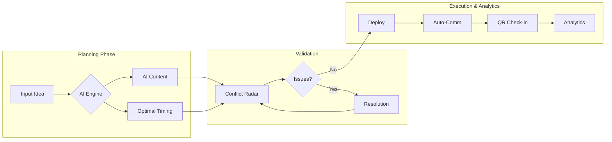
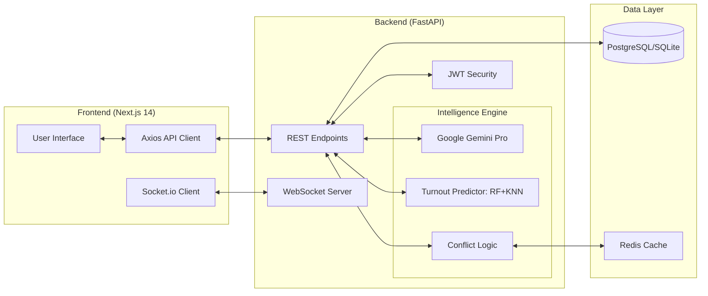
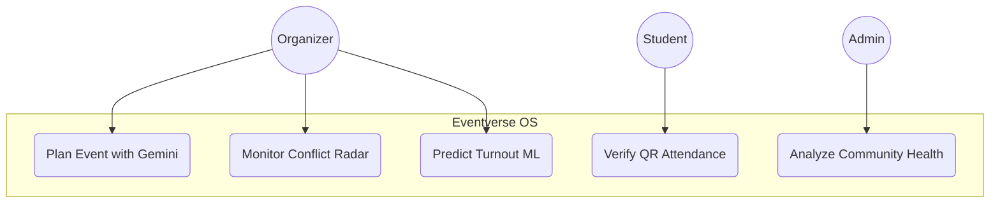
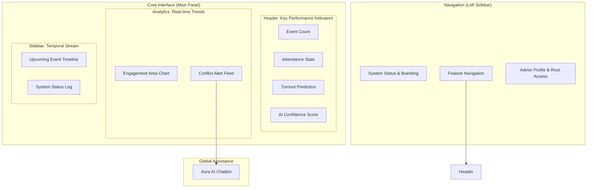

# Eventverse OS - Technical Visualization

## 🔄 1. Process Flow Diagram
*For Slide 6: This shows the end-to-end lifecycle of an event within the system.*

## 🏗️ 2. System Architecture Diagram
*For Slide 8: This illustrates the interaction between Next.js, FastAPI, and AI models.*

## 👥 3. Use Case Diagram
*Defining how different personas interact with the "Brain".*

## 🖼️ 4. Wireframe Layout Map
*For Slide 7: This diagram explains the structural hierarchy of the AI Control Room UI.*

